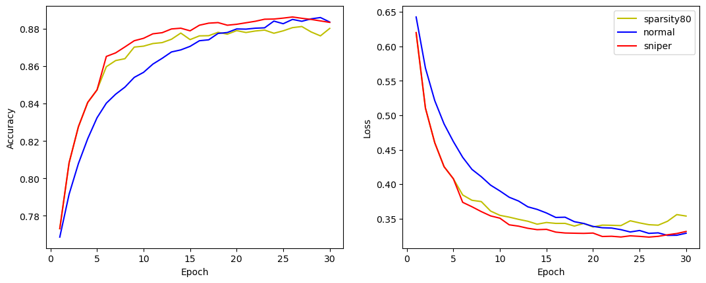

# SNIPER (Single-Shot Network Initialization Pruning Evolving-Rate) Training

This library is meant to accelerate neural net training by initially starting at a high sparsity so that gradient updates go to important weights, then progressively reducing sparsity to fine-tune the model. The process is explained in this [paper](https://arxiv.org/abs/2211.07283) submitted to IEEE TENCON 2024. It works best for training models which require many epochs on a limited dataset; otherwise the efficiency gains are limited and the dataset has to be sampled when weight importance is computed.

Please refer to the [example notebook](example.ipynb) for usage on image classification. We can train 1.5x faster than the dense model for the same performance level (left -- accuracy, right -- loss):

I used [ESPnet](https://github.com/espnet/espnet) for our speech experiments reported in the paper, but I did not want to upload the entire ESPnet here.  
